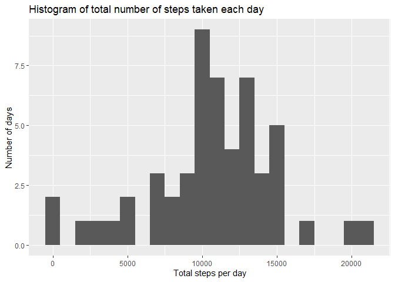
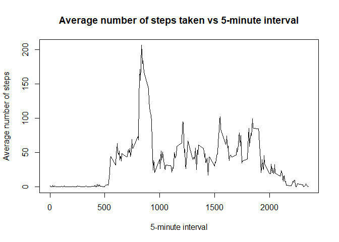
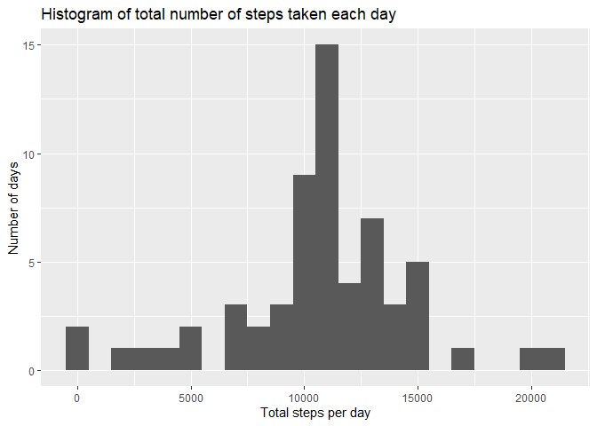
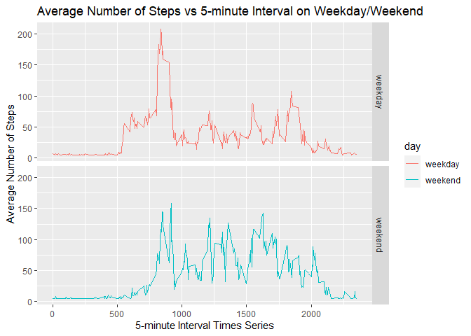

Reproducible Research - Project 1
================
Jessy
3/28/2021

This report contains the codes and the results for the submission of the
first project in the Coursera course: **Reproducible Research**

## I. Loading and Preprocessing of Data

``` r
#read the data to variable activity
activity<-read.csv("activity.csv")

#look at the structure of the data
str(activity)
```

    ## 'data.frame':    17568 obs. of  3 variables:
    ##  $ steps   : int  NA NA NA NA NA NA NA NA NA NA ...
    ##  $ date    : chr  "2012-10-01" "2012-10-01" "2012-10-01" "2012-10-01" ...
    ##  $ interval: int  0 5 10 15 20 25 30 35 40 45 ...

It can be seen that the steps values has a number of NA values.

The next step includes omittimg the NA values from the data.

``` r
#remove the NA values and assign this to a new variable: activity2
activity2<-na.omit(activity)

#look at the structure of the modified data

#structure
str(activity2)
```

    ## 'data.frame':    15264 obs. of  3 variables:
    ##  $ steps   : int  0 0 0 0 0 0 0 0 0 0 ...
    ##  $ date    : chr  "2012-10-02" "2012-10-02" "2012-10-02" "2012-10-02" ...
    ##  $ interval: int  0 5 10 15 20 25 30 35 40 45 ...
    ##  - attr(*, "na.action")= 'omit' Named int [1:2304] 1 2 3 4 5 6 7 8 9 10 ...
    ##   ..- attr(*, "names")= chr [1:2304] "1" "2" "3" "4" ...

Notice that the date variable is a character type, convert this to date
format

``` r
#change the Date variable to date format
activity2$date<-as.Date(activity2$date,"%Y-%m-%d")
```

## II. Mean total number of steps taken per day

First, the total number of steps taken per day is calculated

``` r
#Calculate the total number of steps taken per day, and assign it to total_steps
total_steps<-aggregate(steps ~ date, activity2, FUN=sum)

head(total_steps, n=5)
```

    ##         date steps
    ## 1 2012-10-02   126
    ## 2 2012-10-03 11352
    ## 3 2012-10-04 12116
    ## 4 2012-10-05 13294
    ## 5 2012-10-06 15420

Next, a histogram of the total number of steps taken each day is
plotted.

``` r
#load the ggplot2 library
library(ggplot2)

#plot the histogram
qplot(steps,data=total_steps,geom="histogram",main="Histogram of total number of steps taken each day",binwidth=1000, xlab="Total steps per day",ylab="Number of days")
```

<!-- -->

Lastly, the mean and median of the total number of steps taken per day
are calculated

``` r
mean_steps<-as.integer(mean(total_steps$steps))

print(mean_steps)
```

    ## [1] 10766

``` r
median_steps<-as.integer(median(total_steps$steps))

print(median_steps)
```

    ## [1] 10765

The mean and median of the total number of steps takern per day are
10766 and 10765 respectively.

## III.Average Daily Activity Pattern

Firstly, a time series plot of the 5-minute interval (x-axis) and the
average number of steps taken is created, averaged across all days
(y-axis).

``` r
#Calculate the average number of steps taken over 5-minute interval, and assign it to five_minute_average
five_minute_average <- aggregate(steps~interval, data=activity2, FUN=mean)

plot(five_minute_average$interval,five_minute_average$steps,type='l',xlab="5-minute interval",ylab="Average number of steps", main="Average number of steps taken vs 5-minute interval")
```

<!-- -->

*5-minute interval which contains the maximum number of steps, on
average across all the days in the dataset*

``` r
max_index<-which.max(five_minute_average$steps)
max_interval<-five_minute_average$interval[max_index]

print(paste("Maximum number of steps is comming from the ",toString(max_interval),"th 5-minute interval",sep=""))
```

    ## [1] "Maximum number of steps is comming from the 835th 5-minute interval"

## IV. Imputing missing values

When the data was first loaded, it is clearly seed that there are some
missing values (coded as NA).

Total number of missing values in the dataset is calculated:

``` r
sum(is.na(activity))
```

    ## [1] 2304

The presence of missing days may introduce bias into some calculations
or summaries of the data. In this part of the project, the missing
values are filled with the mean of all the other values. This new
dataset is called new\_activity.

``` r
new_activity<-activity
new_activity$steps[is.na(new_activity$steps)]<-(mean(new_activity$steps,na.rm=TRUE))
```

Check that all the NAs are replaced.

``` r
colSums(is.na(new_activity))
```

    ##    steps     date interval 
    ##        0        0        0

Mean and median of total number of steps taken per day for the new
dataset are calculated.

``` r
new_activity2<-aggregate(steps~date,data=new_activity, FUN=sum)
mean_new<-as.integer(mean(new_activity2$steps))

print(mean_new)
```

    ## [1] 10766

``` r
median_new<-as.integer(median(new_activity2$steps))

print(median_new)
```

    ## [1] 10766

After imputation of missing data, the median and mean values become the
same.

Next, a histogram of the total number of steps taken each day using the
new dataset is plotted.

``` r
qplot(steps,data=new_activity2,geom="histogram",main="Histogram of total number of steps taken each day",binwidth=1000, xlab="Total steps per day",ylab="Number of days")
```

<!-- -->

## V. Differences in Activity Patterns between Weekdays and Weekends

In this part of the project, the dataset with the filled-in missing
values are used.

First, the date variable will be converted to the correct format

``` r
new_activity$date<-as.Date(new_activity$date,"%Y-%m-%d")
```

A new variable is assigned, with 2 levels - “weekday” and “weekend”
indicating whether a given date is a weekday or weekend day.

``` r
new_activity$day<-ifelse(weekdays(new_activity$date) %in% c("Saturday","Sunday"),"weekend",'weekday')
```

Lastly, a panel plot is created, containing a time series plot of the
5-minute interval (x-axis) and the average number of steps taken,
averaged across all weekday days or weekend days (y-axis).

``` r
five_minute_average_new<-aggregate(steps~interval+day,data=new_activity,FUN=mean)

five_minute_average_new_plot<-ggplot(data=five_minute_average_new,aes(x=interval,y=steps,color=day))+
  geom_line()+
  facet_grid(day~.)+
  labs(title="Average Number of Steps vs 5-minute Interval on Weekday/Weekend", y="Average Number of Steps", x="5-minute Interval Times Series")

print(five_minute_average_new_plot)
```

<!-- -->
